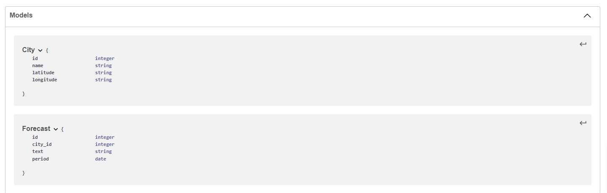
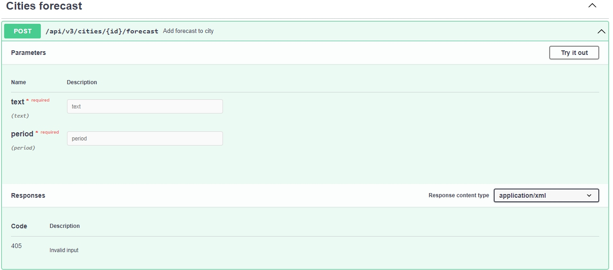
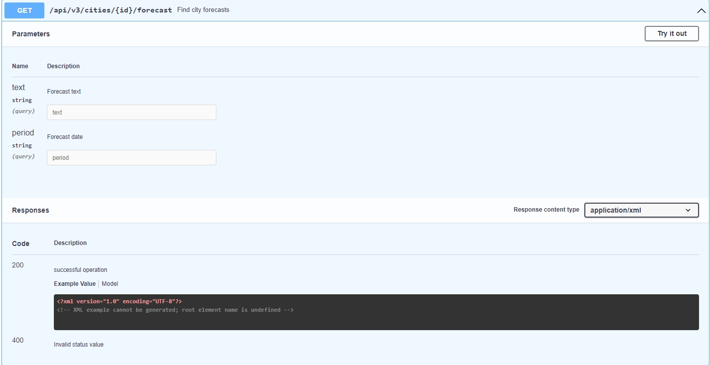

# Development

## Developer: Serhii Ishchuk

## Step 1. Build Docker

`cd application` - move on application directory

`docker-compose build --no-cache` - build image

`docker-compose up -d --remove-orphans` - start all containers

## Step 2. Configure .env.local file

`Need to make .env.local based on .env. Don't forget to add the API key in API_WEATHER_KEY`

## Step 3. Run console command

`docker ps` - need to run, to know container_id, copy container_id

`docker exec -it {container_id} sh` - move on container

`php bin/console application:forecast:process` - execute console command

# API design (no code required)
I propose to create 2 tables for example: City|Forecast

Post request:

Get request:

Read and write requests can return and accept an array of forecasts and dates for forecasts